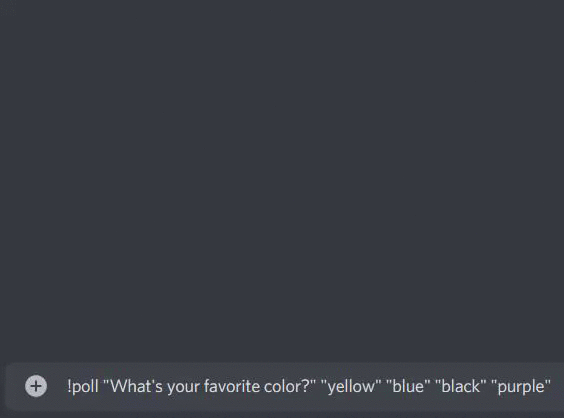

<h1 align="center">
    
    Discord Poll bot
    <br/><br/>
    
</h1>

> ## [Add to your server](https://discord.com/oauth2/authorize?client_id=838152667124727858&scope=bot&permissions=11264)

### How to use:
```
type: !poll "question?" "answer 1" "answer 2" "answer 3"
```

* There can only be up to 10 answers
* Only the poll creator can end it